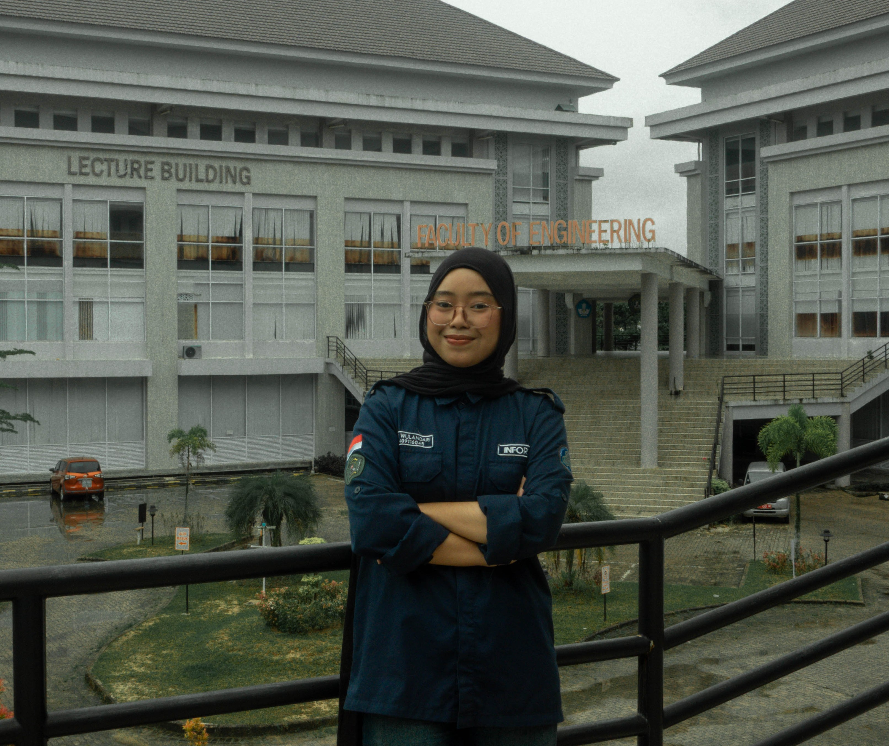

# Minpro1_Portofolio Pribadi_Rini Wulandari

### Nama: Rini Wulandari

### NIM: 2409116048

### Kelas: Sistem Informasi B 2024


# 🔳Tampilan dan Penjelasan Website
Website portofolio ini saya buat menggunakan HTML, CSS, Bootstrap 5, dan Vue JS untuk menampilkan profil, keterampilan, sertifikat, serta informasi kontak saya. Website ini dirancang dengan tampilan yang sederhana, modern, dan responsif agar nyaman dilihat di berbagai perangkat sekaligus memenuhi ketentuan mini project yang diberikan.

## 1. Navigasi Bar


Navigasi bar pada website ini berada di bagian atas halaman dan menggunakan komponen Bootstrap Navbar dengan posisi ```fixed-top```, sehingga tetap terlihat saat pengguna melakukan scroll. Navbar menampilkan nama “Rini Wulandari” di sisi kiri sebagai identitas website, serta menu navigasi di sisi kanan yang terdiri dari Beranda, Tentang Saya, Sertifikat, dan Kontak.

### Penjelasan Kode
HTML
```
<nav class="navbar navbar-expand-lg fixed-top glass-navbar">
  <div class="container">
    
    <a class="navbar-brand fw-bold" href="#">Rini Wulandari</a>

    <button class="navbar-toggler" type="button" 
            data-bs-toggle="collapse" 
            data-bs-target="#navMenu">
      <span class="navbar-toggler-icon"></span>
    </button>

    <div class="collapse navbar-collapse" id="navMenu">
      <ul class="navbar-nav ms-auto nav-spacing">
        <li class="nav-item">
          <a class="nav-link" href="#home">Beranda</a>
        </li>
        <li class="nav-item">
          <a class="nav-link" href="#about">Tentang Saya</a>
        </li>
        <li class="nav-item">
          <a class="nav-link" href="#certificates">Sertifikat</a>
        </li>
        <li class="nav-item">
          <a class="nav-link" href="#contact">Kontak</a>
        </li>
      </ul>
    </div>

  </div>
</nav>
```
- Navigasi Bar menggunakan Bootstrap sehingga lebih responsif.
- Elemen ```<nav>``` dengan kelas navbar, ```navbar-expand-lg```, dan ```fixed-top``` membuat navbar tetap berada di bagian atas saat halaman di-scroll serta menyesuaikan tampilannya pada berbagai ukuran layar. Kelas tambahan glass-navbar memberikan efek transparan atau blur sesuai desain. Di dalamnya terdapat container agar tata letaknya rapi dan sejajar dengan konten lainnya. Nama “Rini Wulandari” ditampilkan sebagai identitas website melalui ```navbar-brand```, sementara tombol ```navbar-toggler``` berfungsi sebagai menu hamburger pada tampilan mobile. Bagian menu navigasi dibuat menggunakan ```navbar-nav``` dan diposisikan ke kanan dengan ```ms-auto```, sedangkan setiap ```nav-link``` mengarahkan pengguna ke section tertentu dalam halaman seperti Beranda, Tentang Saya, Sertifikat, dan Kontak tanpa perlu berpindah halaman.


CSS
```
/* Navigasi */
.glass-navbar{
    background: rgba(255,255,255,0.75);
    backdrop-filter: blur(6px);
    -webkit-backdrop-filter: blur(6px);
    transition: all 0.3s ease;
}

.glass-navbar.scrolled{
    background: rgba(255,255,255,0.9);
    box-shadow: 0 4px 18px rgba(0,0,0,0.08);
}

.nav-link{
  font-weight: 500;
  transition: 0.3s;
}

.nav-link:hover{
  color: black;
}

.nav-spacing .nav-item{
    margin-left: 25px;
}

.nav-link{
    letter-spacing: 0.5px;
    font-weight: 500;
}
```
- ```.glass-navbar``` → Membuat navbar transparan dengan efek blur agar terlihat modern dan elegan.
- ```.glass-navbar.scrolled``` → Mengubah tampilan navbar saat di-scroll menjadi lebih solid dan diberi bayangan agar lebih jelas.
- ```.nav-link``` → Mengatur tampilan teks menu (ketebalan huruf dan efek transisi).
- ```.nav-link:hover``` → Mengubah warna teks menjadi hitam saat kursor diarahkan ke menu.
- ```.nav-spacing``` ```.nav-item``` → Memberikan jarak antar menu agar tidak terlalu rapat.
- ```letter-spacing``` pada ```.nav-link``` → Memberi sedikit jarak antar huruf agar tampilan lebih rapi dan nyaman dibaca.

#

## 2. Section Beranda


Berisi:
1. Foto Profil
2. Pengenalan Nama dan Deskripsi singkat.

### Penjelasan Kode
HTML
```
<!-- Beranda -->
<section id="home" class="hero-section">
  <div class="container">
    <div class="row align-items-center gx-2">

      <div class="col-md-5 mb-5 mb-md-0 text-center text-md-start">
        <h5>Perkenalkan, Saya</h5>
        <h1 class="fw-bold display-5">{{ name }}</h1>
        <p class="text-muted">{{ description }}</p>
        <a href="#about" class="btn btn-dark rounded-pill px-4">
          Tentang Saya
        </a>
      </div>

      <div class="col-md-7 text-center hero-image-wrapper">
        
      </div>

    </div>
  </div>
</section>
```
```
createApp({
  data(){
    return{

      name:"Rini Wulandari",
      description:"Mahasiswi Aktif S1 Sistem Informasi Fakultas Teknik Universitas Mulawarman.",

      about:{
        title:"Latar Belakang",
        image:"images/Profil2.jpg",
        description:"Saya adalah mahasiswa Sistem Informasi Universitas Mulawarman dengan minat pada pengelolaan dan pengolahan data, khususnya di bidang database. Saat ini saya sedang mendalami konsep perancangan dan manajemen basis data untuk mendukung pengembangan sistem informasi yang efektif. Selain itu, saya terbiasa menggunakan Microsoft Word, Microsoft Excel, dan Canva untuk kebutuhan akademik maupun organisasi, serta didukung dengan kemampuan komunikasi dan public speaking yang baik."
      },
```
- Beranda (hero section) sebagai tampilan awal website.
- Di dalamnya terdapat teks perkenalan, nama yang ditampilkan secara dinamis menggunakan Vue ```({{ name }})```, serta deskripsi singkat ```({{ description }})```. Tombol “Tentang Saya” berfungsi untuk mengarahkan pengguna ke bagian profil.
- Layout dibuat dua kolom menggunakan Bootstrap agar teks berada di kiri dan foto profil di kanan, sehingga tampilannya terlihat rapi, seimbang, dan responsif di berbagai ukuran layar.

CSS
```
.hero-section{
    min-height: 100vh;
    padding-top: 120px;
    display: flex;
    align-items: center;
}

.hero-section .col-md-5{
    padding-right: 10px;
}

.hero-section .col-md-7{
    padding-left: 10px;
}

.hero-image-wrapper{
    position: relative;
    display: flex;
    justify-content: center;
    align-items: center;
}

.hero-image{
    width: 100%;
    max-width: 480px; 
    aspect-ratio: 1/1;
    object-fit: cover;
    object-position: center 23%;

    border-radius: 50%;
    border: 6px solid white;

    box-shadow: 0 20px 40px rgba(0,0,0,0.15);
    transition: 0.4s ease;
    z-index: 2;
}

.hero-image:hover{
    transform: scale(1.05);
}

.hero-image-wrapper::before{
    content: "";
    position: absolute;
    width: 120%;
    height: 120%;
    background: radial-gradient(circle, rgba(147,197,253,0.3), transparent 70%);
    border-radius: 50%;
    z-index: 1;
    filter: blur(20px);
}

@media (max-width: 768px){

    .hero-section{
        padding-top: 100px;
        text-align: center;
    }

    .hero-image{
        max-width: 260px;
    }

}

.section-space{
padding:100px 0;
}
```
- ```.hero-section``` → Mengatur tinggi section memenuhi layar (100vh), memberi jarak dari atas, dan membuat konten rata tengah secara vertikal.
- ```.col-md-5 & .col-md-7``` → Menyesuaikan jarak antara teks dan gambar agar lebih rapat dan proporsional.
- ```.hero-image-wrapper``` → Mengatur posisi gambar agar berada di tengah dan memungkinkan penambahan efek latar belakang.
- ```.hero-image``` → Mengatur ukuran foto, membuatnya berbentuk lingkaran, menambahkan border putih, bayangan, serta efek zoom saat hover.
- ```.hero-image-wrapper::before``` → Menambahkan efek glow atau cahaya lembut di belakang foto agar terlihat lebih menarik.
- ```@media (max-width: 768px)``` → Mengatur tampilan agar tetap responsif di layar kecil dengan mengecilkan ukuran gambar dan menyesuaikan jarak.
- ```.section-space``` → Memberikan jarak atas dan bawah pada setiap section agar tampilan lebih lega dan rapi.

#

## 3. Section Tentang Saya


Berisi:
1. Latar Belakang
2. Skill
3. Pengalaman

### Penjelasan Kode
HTML
```
<!-- Tentang Saya -->
<section id="about" class="about-section">
  <div class="container">

    <div class="text-center mb-5">
      <h2 class="fw-bold">Tentang Saya</h2>
    </div>

    <div class="row g-4 align-items-stretch">

      <!-- Latar Belakang -->
      <div class="col-md-6">
        <div class="about-card h-100 p-4 text-center">

          

          <h4 class="fw-bold mb-3">{{ about.title }}</h4>

          <p class="text-muted">
            {{ about.description }}
          </p>

        </div>
      </div>

      <div class="col-md-6">
        <div class="row g-4 h-100">

          <!-- Skill -->
          <div class="col-12">
            <div class="about-card right-card p-4">

              <h5 class="fw-bold mb-2">Skill</h5>
              <div class="accent-line mb-4"></div>

              <div v-for="skill in skills" class="mb-3">

                <div class="d-flex justify-content-between">
                  <span>{{ skill.name }}</span>
                  <span>{{ skill.level }}%</span>
                </div>

                <div class="progress">
                  <div class="progress-bar skill-bar"
                       :style="{ width: skill.level + '%' }">
                  </div>
                </div>

              </div>

            </div>
          </div>

          <!-- Pengalaman -->
          <div class="col-12">
            <div class="about-card right-card p-4">

              <h5 class="fw-bold mb-2">Pengalaman</h5>
              <div class="accent-line mb-3"></div>

              <p class="text-muted mb-0">
                {{ experience }}
              </p>

            </div>
          </div>

        </div>
      </div>

    </div>

  </div>
</section>
```
```
      about:{
        title:"Latar Belakang",
        image:"images/Profil2.jpg",
        description:"Saya adalah mahasiswa Sistem Informasi Universitas Mulawarman dengan minat pada pengelolaan dan pengolahan data, khususnya di bidang database. Saat ini saya sedang mendalami konsep perancangan dan manajemen basis data untuk mendukung pengembangan sistem informasi yang efektif. Selain itu, saya terbiasa menggunakan Microsoft Word, Microsoft Excel, dan Canva untuk kebutuhan akademik maupun organisasi, serta didukung dengan kemampuan komunikasi dan public speaking yang baik."
      },

      skills:[
        {name:"Microsoft Word", level:90},
        {name:"Microsoft Excel", level:85},
        {name:"Database", level:75},
        {name:"Public Speaking", level:90}
      ],

      experience:"Sejauh ini telah mengembangkan soft skill yang diinginkan dan pada tahun 2025 saat Kepengurusan INFORSA 2025 telah berpartisipasi aktif dalam kegiatan program kerja. Akademik juga menjadi yang paling utama dan telah mengerjakan beberapa project mata kuliah maupun praktikum.",
```
- Tentang Saya secara dinamis menggunakan Vue.js.
- Bagian kiri menampilkan latar belakang yang berisi gambar, judul, dan deskripsi yang diambil dari objek ```about```, sehingga isinya bisa diubah langsung dari data tanpa mengedit HTML.
- Di sisi kanan terdapat dua card, yaitu Skill dan Pengalaman. Data skill ditampilkan menggunakan ```v-for``` untuk melakukan perulangan array ```skills```, lalu level kemampuannya divisualisasikan dalam bentuk progress bar yang lebarnya menyesuaikan persentase. Sementara itu, bagian pengalaman mengambil teks dari variabel ```experience```.

CSS
```
/* Tentang Saya */
.about-section{
    padding: 100px 0;
    background: #f9fafb;
}

.about-card{
    background: white;
    border-radius: 25px;
    box-shadow: 0 15px 35px rgba(0,0,0,0.06);
    transition: 0.3s ease;
}

.about-card:hover{
    transform: translateY(-8px);
    box-shadow: 0 20px 45px rgba(0,0,0,0.1);
}

.about-image{
    width: 100%;
    max-width: 250px;
    border-radius: 15px;
    object-fit: cover;
    box-shadow: 0 10px 25px rgba(0,0,0,0.1);
}

.accent-line{
    width: 40px;
    height: 3px;
    background: #1f2937;
    border-radius: 5px;
}
```
- ```.about-section``` → Memberikan jarak atas-bawah (padding) dan warna background terang agar section terlihat bersih dan lega.
- ```.about-card``` → Membuat tampilan card berwarna putih dengan sudut membulat dan bayangan halus supaya terlihat modern.
- ```.about-card:hover``` → Memberikan efek naik sedikit dan bayangan lebih tegas saat kursor diarahkan ke card.
- ```.about-image``` → Mengatur ukuran gambar agar proporsional, sudutnya membulat, dan diberi bayangan agar lebih menarik.
- ```.accent-line``` → Membuat garis kecil sebagai elemen dekoratif untuk mempertegas judul di dalam card.

#

## 4. Section Sertifikat


Menampilkan sertifikat-sertifikat yang diraih sejauh ini.

### Penjelasan Kode
HTML
```
<!-- Sertifikat -->
<section id="sertifikat" class="section-space bg-light">
  <div class="container text-center">

    <h2 class="fw-bold mb-5">Sertifikat</h2>

    <div class="row g-4">
      <div class="col-lg-4 col-md-6" v-for="cert in sertifikat">
        <div class="certificate-card p-4 h-100">
          
          

          <h6 class="fw-bold">{{ cert.title }}</h6>
          <p class="text-muted small mb-0">{{ cert.desc }}</p>

        </div>
      </div>
    </div>

  </div>
</section>
```
```
      sertifikat:[
        {title:"APLIKASI 2025", desc:"Anggota Divisi Acara APLIKASI 2025", image:"images/AnggotaDivisiAcara_APLIKASI.jpg"},
        {title:"Kepengurusan INFORSA Tahun 2025", desc:"Sekretaris Departemen Advocacy & Welfare", image:"images/Sekretaris_Adwel.png"},
        {title:"INSEVENT 2025", desc:"Anggota Divisi Acara INSEVENT 2025", image:"images/AnggotaDivisiAcara_INSEVENT.jpg"},
        {title:"Knowledge Center", desc:"Peserta", image:"images/Peserta_KC.jpg"},
        {title:"Moderator Talkshow", desc:"Kegiatan INSEVENT 2025", image:"images/Moderator_Talkshow.jpg"},
        {title:"Upgrading Kepengurusan INFORSA Tahun 2025", desc:"Peserta", image:"images/Peserta_Upgrading.jpg"}
      ]
```
- Section sertifikat secara dinamis menggunakan ```Vue.js```.
- Data sertifikat disimpan dalam array ```sertifikat``` yang berisi judul, deskripsi, dan gambar untuk setiap sertifikat. Pada bagian HTML, digunakan ```v-for``` untuk melakukan perulangan sehingga setiap data dalam array otomatis ditampilkan menjadi card. Gambar ditampilkan menggunakan binding ```:src```, sedangkan judul dan deskripsi ditampilkan dengan interpolation ```{{ }}```. Dengan cara ini, jika ingin menambah atau mengubah sertifikat, cukup mengedit data tanpa perlu mengubah struktur HTML.

CSS
```
/* Sertifikat */
.certificate-card{
    background: white;
    border-radius: 20px;
    box-shadow: 0 15px 35px rgba(0,0,0,0.05);
    transition: 0.3s ease;
}

.certificate-card:hover{
    transform: translateY(-8px);
    box-shadow: 0 20px 45px rgba(0,0,0,0.1);
}

.certificate-image{
    width: 100%;
    height: 180px;
    object-fit: cover;
    border-radius: 15px;
    margin-bottom: 15px;
}

.progress{
    height: 8px;
    background-color: #e5e7eb;
    border-radius: 10px;
}

.skill-bar{
    background-color: #7c3aed; /* warna ungu tema kamu */
    border-radius: 10px;
}
```
- ```.certificate-card``` → Membuat tampilan card sertifikat berwarna putih dengan sudut membulat dan bayangan halus agar terlihat modern.
- ```.certificate-card:hover``` → Memberikan efek naik dan bayangan lebih tegas saat kursor diarahkan ke card.
- ```.certificate-image``` → Mengatur ukuran gambar sertifikat agar proporsional, rapi, dan terpotong otomatis jika perlu (```object-fit: cover```).
- ```.progress``` → Mengatur tampilan dasar progress bar dengan tinggi kecil dan sudut membulat.
- ```.skill-bar``` → Memberikan warna ungu pada isi progress bar sesuai tema website dan membuat sudutnya membulat.

#

## 5. Section Kontak


Menampilkan icon kontak dan media sosial saya yang bisa dihubungi.

### Penjelasan Kode
HTML
```
<!-- Kontak -->
<section id="contact" class="contact-section text-center">
  <div class="container">

    <p class="contact-label">Kontak</p>
    <h2 class="fw-bold fs-2 mb-4">Hubungi Saya</h2>

    <div class="social-icons d-flex justify-content-center gap-4">

      <a href="https://wa.me/6285255509272" class="social-item">
        <i class="bi bi-telephone"></i>
      </a>

      <a href="mailto:riniwulandari1205@email.com" class="social-item">
        <i class="bi bi-envelope"></i>
      </a>

      <a href="https://github.com/RiniWu" 
         class="social-item" 
         target="_blank">
        <i class="bi bi-github"></i>
      </a>

      <a href="https://www.instagram.com/riniwulan_dari_?igsh=MTNtOXNhbTVkbHc5MA==" 
         class="social-item" 
         target="_blank">
        <i class="bi bi-instagram"></i>
      </a>

    </div>

  </div>
</section>
```
- Section Kontak yang menampilkan informasi dan akses langsung ke media komunikasi.
- Di dalamnya terdapat judul “Hubungi Saya” serta beberapa ikon sosial media seperti WhatsApp, email, GitHub, dan Instagram.
- Setiap ikon dibungkus dalam tag ```<a>``` sehingga dapat diklik dan langsung mengarah ke link tujuan, misalnya ```wa.me``` untuk WhatsApp dan ```mailto:``` untuk email.
- Ikon yang digunakan berasal dari Bootstrap Icons, sehingga tampilannya sederhana dan konsisten. Tata letaknya dibuat rata tengah menggunakan kelas Bootstrap agar terlihat rapi dan mudah diakses oleh pengunjung.

CSS
```
/* Kontak */
.contact-section{
    padding: 120px 0;
    background: #f9fafb;
}

.contact-label{
    font-weight: 600;
    margin-bottom: 10px;
}

.social-item{
    width: 60px;
    height: 60px;
    border-radius: 50%;
    background: #ffffff;
    display: flex;
    align-items: center;
    justify-content: center;
    font-size: 22px;
    color: #1f2937; /* hitam/navy */
    box-shadow: 0 10px 25px rgba(0,0,0,0.08);
    transition: 0.3s ease;
    text-decoration: none;
}

.social-item:hover{
    background: #f3f4f6;
    color: #1f2937;
    transform: translateY(-5px);
}

.social-item:active,
.social-item:focus{
    background: #f3f4f6;
    color: #1f2937;
    outline: none;
}
```
- ```.contact-section``` → Memberikan jarak atas-bawah yang luas dan background terang agar bagian kontak terlihat bersih dan terpisah dari section lain.
- ```.contact-label``` → Mengatur teks label “Kontak” agar sedikit lebih tebal dan memiliki jarak bawah.
- ```.social-item``` → Mendesain ikon sosial menjadi lingkaran dengan ukuran tetap, rata tengah, memiliki bayangan, dan warna teks gelap agar terlihat modern.
- ```.social-item:hover```` → Memberikan efek perubahan warna background dan sedikit naik saat kursor diarahkan ke ikon.
- ```.social-item:active, :focus``` → Menjaga tampilan ikon tetap konsisten saat diklik atau difokuskan.

#

## 6. Footer


### Penjelasan Kode
HTML
```
<footer class="footer">
  <div class="container text-center">
    <p class="mb-0">
      © 2026 Rini Wulandari. Mahasiswa S1 Sistem Informasi Universitas Mulawarman.
    </p>
  </div>
</footer>
```
- footer terletak di bagian paling bawah website.
- Di dalamnya terdapat teks copyright yang menampilkan tahun, nama, dan informasi singkat mengenai status sebagai mahasiswa Sistem Informasi Universitas Mulawarman.
- Elemen ```container``` digunakan agar isi footer tetap rapi dan sejajar dengan bagian lain, sedangkan ```text-center``` membuat teks berada di tengah.

CSS
```
.footer{
    background: #0f172a;
    color: #cbd5e1;
    padding: 25px 0;
    font-size: 14px;
    border-top: 1px solid rgba(255,255,255,0.1);
}
```
- ```background: #0f172a;``` → Memberikan warna gelap pada footer agar terlihat tegas dan berbeda dari section lainnya.
- ```color: #cbd5e1;``` → Mengatur warna teks menjadi abu terang agar kontras dan mudah dibaca di background gelap.
- ```padding: 25px 0;``` → Memberikan jarak atas dan bawah supaya isi footer tidak terlalu rapat.
- ```font-size: 14px;``` → Mengatur ukuran teks agar terlihat lebih kecil dan sesuai sebagai bagian penutup.
- ```border-top``` → Menambahkan garis tipis di bagian atas footer untuk memberi pemisah dengan section sebelumnya.

#

# 💻Teknologi Yang Digunakan
## 1. HTML5
Membangun struktur dasar website seperti navbar, section, card, dan footer.

## 2. CSS3
Mengatur tampilan, warna, layout, efek hover, dan responsivitas tambahan.

## 3. Bootstrap 5
Membantu layouting (grid system, container, row, col), komponen seperti navbar dan progress bar, serta membuat tampilan responsif.

## 4. Bootstrap Icons
Menampilkan ikon sosial media pada bagian kontak.

## 5. Vue JS (CDN)
Mengelola dan menampilkan data secara dinamis seperti nama, deskripsi, skill, dan sertifikat menggunakan interpolation dan ```v-for```.

## 6. Google Fonts (Poppins)
Memberikan tampilan tipografi yang lebih modern dan konsisten.


